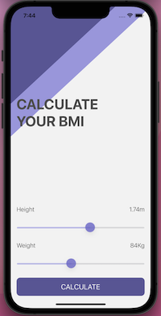
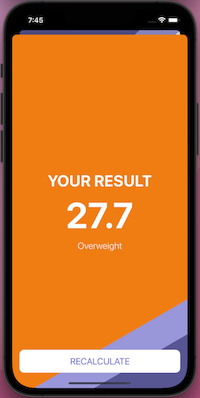
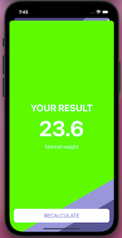
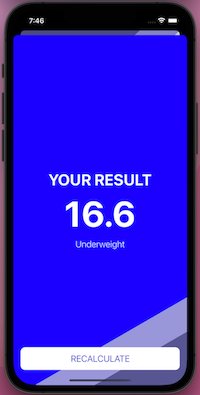

#  BMI Calculator

<h4 align="center">iOS Calculator to know your BMI (Body Mass Index)</h4>

  •<a href="#key-features">Key Features</a>
  •<a href="#how-to-use">How To Use</a> 

## Code Quality Status
 
 
 
 
  

## Key Features

* UIKit
* MVC
* Slider
* Structs
* Classes and inheritance
* Modally segue
* Optionals

## How To Use
Move the sliders to set your height and your weight, then press calculate to check your body mass index, and discover if you have a normal weight, overweight, or underweight.